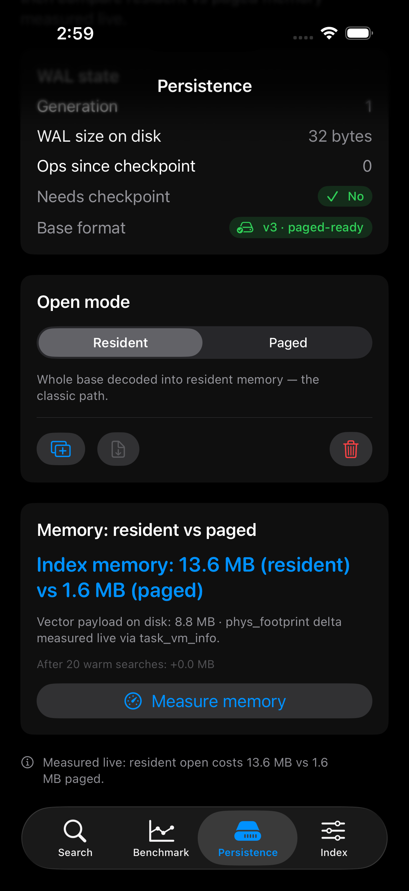
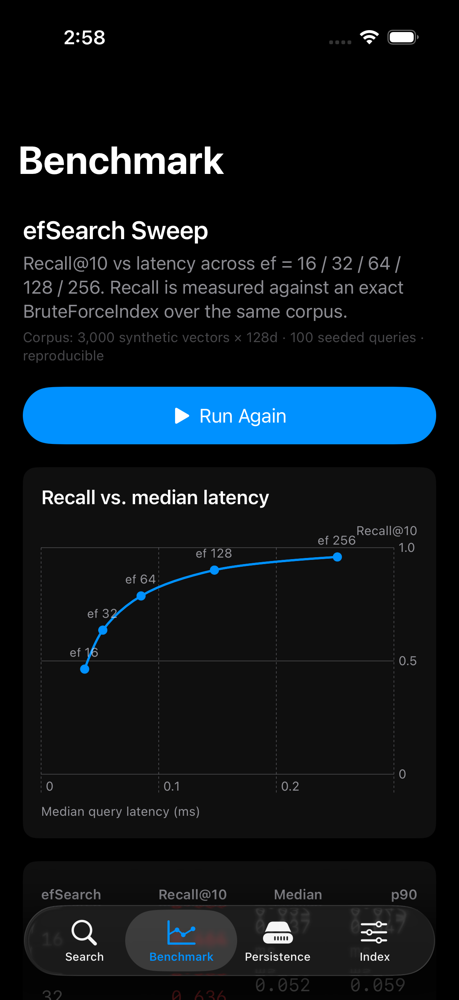

<p align="center">
  
</p>
<p align="center">
    Pure-Swift vector search for Apple platforms — powered by Accelerate.
  </p>
  <p align="center">
    <a href="https://github.com/vivekptnk/ProximaKit/actions/workflows/ci.yml"></a>
    <a href="https://swift.org"></a>
    
    <a href="LICENSE"></a>
  </p>
</p>


ProximaKit finds **similar content by understanding what it means** — not by matching keywords. Type "beach vacation" and it finds photos of oceans, notes about travel, articles about tropical destinations. None of them need to contain the words "beach" or "vacation."

Everything runs **on-device**. No server, no API key, no internet. Just your app and Apple Silicon.

> *HNSW implemented from scratch in Swift. Zero third-party runtime dependencies. Zero C++ wrappers.*

<p align="center">
  
</p>
<p align="center"><sub>Animated replay of a <a href="#demo">real <code>ProximaDemo</code> session</a> — try it: <code>swift run ProximaDemo</code></sub></p>

## Use ProximaKit to build

- **Private notes & document search** — index a user's own text and retrieve by meaning, entirely on-device.
- **On-device RAG** — retrieve context for an on-device LLM to answer from, offline. Runnable example: [`Examples/OnDeviceRAG/`](Examples/OnDeviceRAG/).
- **Photo & image similarity** — embed images with Apple's Vision framework and surface visual near-duplicates.
- **Agent memory** — a durable, crash-safe vector store an on-device agent can write to and recall from ([Agent Memory guide](Sources/ProximaKit/Documentation.docc/AgentMemory.md) · [ADR-015](docs/adr/ADR-015-agent-memory-integration.md)).

Everything stays local: no server, no API key, no vectors leaving the device.

## Install

Add ProximaKit with the Swift Package Manager:

```swift
// Package.swift
dependencies: [
    .package(url: "https://github.com/vivekptnk/ProximaKit.git", from: "1.9.0")
]
```

```swift
.target(
    name: "YourApp",
    dependencies: [
        "ProximaKit",          // Core: indices, metrics, quantization, persistence
        "ProximaEmbeddings",   // Optional: turns text/images into vectors
    ]
)
```

Requires iOS 17+ / macOS 14+ / visionOS 1+ and Swift 5.9+ (Xcode 15+). Apple Silicon is recommended — the SIMD paths are tuned for it.

## Quick start

Embed text with Apple's on-device model, index it, and search by meaning — no downloads, no API key:

```swift
import Foundation
import ProximaKit
import ProximaEmbeddings

let embedder = try NLEmbeddingProvider(language: .english)
let index = HNSWIndex(dimension: embedder.dimension, metric: CosineDistance())

// Index a few sentences by meaning.
for text in ["Dogs love playing fetch in the park",
             "Fresh pasta beats dried every time"] {
    try await index.add(embedder.embed(text), id: UUID())
}

// Search by meaning — no shared keywords required.
let query = try await embedder.embed("animals playing outside")
let hits = await index.search(query: query, k: 3)   // the dog sentence ranks first
```

Apple's built-in language model does the embedding on-device — no API key. Want metadata, per-user filtering, or the distance behind each hit? See [Search text by meaning](#search-text-by-meaning) below.

### Run the demo

```bash
git clone https://github.com/vivekptnk/ProximaKit.git
cd ProximaKit
swift run ProximaDemo
```

Or open `Examples/ProximaDemoApp/ProximaDemoApp.xcodeproj` in Xcode for the full GUI experience.

### Build a RAG app

Retrieval-augmented generation over your own notes — embed, index, retrieve, and let an on-device language model answer with citations. The whole pipeline is ~130 lines of Swift, works in airplane mode, and ships as a runnable target:

```bash
swift run OnDeviceRAG -question "How long should I steep cold brew?"
```

ProximaKit does the retrieval; Apple's FoundationModels on-device LLM answers where the OS provides one, with a deterministic template model standing in everywhere else. Walkthrough: [`docs/RAG-TUTORIAL.md`](docs/RAG-TUTORIAL.md) · Code: [`Examples/OnDeviceRAG/`](Examples/OnDeviceRAG/)

New to vector search itself? The [interactive DocC tutorial](https://vivekptnk.github.io/ProximaKit/tutorials/meetproximakit) builds the core pipeline step by step.

## Measured, not claimed

ProximaKit publishes numbers instead of adjectives. Functional tests run on normal PR CI; long Recall/PQ acceptance suites are opt-in and release-gated, while the SIFT smoke regression gate covers core-index PRs. Release-mode latency and QPS against FAISS and ScaNN are generated nightly by the cross-library harness and published as CI artifacts — never hand-copied into docs where they'd go stale.

- **Benchmark card** (start here): [`docs/BENCHMARK-CARD.md`](docs/BENCHMARK-CARD.md)
- **Full methodology and results:** [`docs/BENCHMARKS.md`](docs/BENCHMARKS.md)

Backed by ~600 tests across nine releases. Downstream, ProximaKit is the vector-search layer of the author's own Chakravyuha projects — most concretely tinybrain, an on-device agent-memory system whose ProximaKit adoption is documented in the [Agent Memory guide](Sources/ProximaKit/Documentation.docc/AgentMemory.md), the [RAG wrapper recipe](docs/RAG-WRAPPER-RECIPE.md), and [ADR-015](docs/adr/ADR-015-agent-memory-integration.md).

## Why ProximaKit

- **Pure Swift, from scratch.** The HNSW graph is implemented in Swift on Foundation and Accelerate — not a wrapper around a C++ library.
- **Zero third-party runtime dependencies in the core library** — pure Swift on Foundation and Accelerate. (The one package dependency, swift-docc-plugin, is documentation tooling and never ships in your app.)
- **No server, no cloud.** Everything runs on-device — no API key, no network, no data leaving the device.
- **Hybrid search.** Dense semantic recall fused with BM25 keyword matching for exact terms, SKUs, and error codes ([`docs/HYBRID.md`](docs/HYBRID.md)).
- **Two quantization tiers.** INT8 scalar (~4×, any metric, no training) and product quantization (32×), each with opt-in exact reranking.
- **Crash-safe persistence.** Versioned binary format, an opt-in write-ahead log for O(change) saves, and memory-mapped paging — recovery proven with an out-of-process SIGKILL rig, not just asserted in-process.

## How it compares

A Swift developer's real shortlist is other on-device Swift libraries — not FAISS or Pinecone. Here is the honest lay of the land:

| | ProximaKit | SimilaritySearchKit | VecturaKit | USearch |
|---|---|---|---|---|
| **Core** | Pure Swift | Pure Swift | Pure Swift | C++ core, Swift binding |
| **Focus** | Search engine (+ optional embeddings) | Embeddings + search, batteries-included | On-device vector DB, pluggable embedders | Bare similarity-search engine |
| **Search** | HNSW (from scratch) | Brute force (HNSW on the roadmap) | Vector + BM25 hybrid | HNSW |
| **Platforms** | iOS 17 · macOS 14 · visionOS 1 | iOS · macOS | iOS · macOS · tvOS · visionOS · watchOS | Cross-platform (iOS, Android, servers, WASM) |

- **Choose ProximaKit** when you want a pure-Swift, from-scratch HNSW engine for Apple platforms with quantization tiers, hybrid BM25+dense search, and crash-safe incremental persistence — no C++ bridge, no server.
- **Choose SimilaritySearchKit** when you want the fastest path to on-device semantic search with embedding models bundled in, and a corpus small enough that brute-force search is fine.
- **Choose VecturaKit** when you want a batteries-included on-device vector database with pluggable embedders (Apple NL, OpenAI-compatible, MLX) and the broadest Apple-platform reach, including watchOS and tvOS.
- **Choose USearch** when you need a battle-tested, cross-platform HNSW engine — the same index across iOS, Android, servers, and the browser — and you are comfortable consuming a C++ core through its Swift binding.

FAISS and Pinecone are a different category: FAISS is a C++ library aimed at server and desktop that needs bridging to run on Apple devices, and Pinecone is a hosted cloud service where your vectors leave the device. Full side-by-side, with sources: [`docs/COMPARISON.md`](docs/COMPARISON.md).

## What's inside

HNSW graph search, hybrid BM25+dense retrieval, product (32×) and INT8 (~4×) quantization, graph-aware filtered search, nine distance metrics, crash-safe persistence with WAL and mmap paging, and Apple-framework embedding providers — every index a Swift `actor`. The full capability matrix, with a design-decision link on each row, lives in [`docs/CAPABILITIES.md`](docs/CAPABILITIES.md).

## Learn more

- **Documentation:** [API reference (DocC)](https://vivekptnk.github.io/ProximaKit/) · [Architecture](docs/ARCHITECTURE.md) · [Hybrid search](docs/HYBRID.md) · [Benchmarks](docs/BENCHMARKS.md)
- **Examples:** [On-device RAG](Examples/OnDeviceRAG/) · [Demo app — iOS / macOS / visionOS](Examples/ProximaDemoApp/)
- **Contributing:** [CONTRIBUTING.md](CONTRIBUTING.md)

## How it works

<p align="center">
  
</p>

```
You type: "beach vacation"
         |
         v
  ┌─────────────────┐
  │ EmbeddingProvider│   Converts text to numbers
  │ "beach" → [0.23, │   that capture its MEANING
  │  -0.41, 0.87...]│   (using Apple's NaturalLanguage)
  └────────┬─────────┘
           v
  ┌─────────────────┐
  │   HNSWIndex      │   Searches a graph structure:
  │                   │   1. Start at top layer (express lane)
  │  Layer 2: ·──·    │   2. Greedily descend to best region
  │  Layer 1: ·─·──·  │   3. Beam search on layer 0
  │  Layer 0: ········ │   4. Return k closest matches
  └────────┬──────────┘
           v
  ┌──────────────────┐
  │  Search Results   │   Ranked by similarity:
  │  0.12 Ocean waves │   Lower distance = more similar
  │  0.18 Tropical... │
  │  0.25 Travel...   │
  └──────────────────┘
```

All of this happens **on your device**, using Apple's Accelerate framework for SIMD math. No internet required.


## Demo

**ProximaDemoApp** is a macOS SwiftUI app that ships with the repo. It indexes 46 sample documents at startup and lets you search by meaning in real time, tune `efSearch` with a slider, add your own notes to the live index, and persist across app launches.

The app now runs on **iPhone, iPad, macOS, and visionOS** from a single SwiftUI target. Real simulator screenshots (semantic search — note zero keyword overlap between query and results):

<p align="center">
  
  &nbsp;&nbsp;
  
</p>

And on Apple Vision Pro, the same target renders as a spatial glass panel (real visionOS simulator screenshot):

<p align="center">
  
</p>

Beyond Search, the app now ships two more screens. A **Persistence lab** opens the index journaled (WAL), shows live WAL state — generation, bytes on disk, ops since checkpoint — checkpoints into a page-aligned base, and demonstrates the library's honest typed-error path: a `.paged` open on an unpadded base is refused with a "Paged open blocked" banner, not silently faked. It also measures resident-vs-paged process memory **live, in-app**, via the same `task_vm_info.phys_footprint` probe the library's `PagedVectorMemoryTests` use — the exact figure varies run to run and simulator vs device, so it's captured in the screenshot rather than quoted here. A **Benchmark** tab runs a seeded `efSearch` sweep (16–256) and charts recall@10 against latency with SwiftUI Charts, recall measured against an exact `BruteForceIndex` ground truth. Three more screens round out the demo: an **Index Inspector** that visualizes the live HNSW graph as a force-directed diagram (SwiftUI `Canvas`/`TimelineView`, tap a node to see its stored text and metadata), **Import** for adding your own `.txt`/`.md` files or folders into the live index, and **Export** for writing the current search results to CSV or JSON.

<p align="center">
  
  &nbsp;&nbsp;
  
</p>

The animated terminal at the top of this README replays a real `swift run ProximaDemo` CLI session, and the desktop layout looks like this (illustrative mock-up):

<p align="center">
  
</p>

Open in Xcode: `open Examples/ProximaDemoApp/ProximaDemoApp.xcodeproj`


## Search text by meaning

The simplest thing you can do. Uses Apple's built-in language model — no downloads, no setup.

```swift
import ProximaKit
import ProximaEmbeddings

// Set up
let embedder = try NLEmbeddingProvider(language: .english)
let index = HNSWIndex(dimension: embedder.dimension, metric: CosineDistance())

// Add content
let sentences = [
    "The cat sat on the warm windowsill",
    "Dogs love playing fetch in the park",
    "Fresh pasta tastes better than dried",
    "The sunset painted the sky orange",
]

for sentence in sentences {
    let vector = try await embedder.embed(sentence)
    let metadata = try JSONEncoder().encode(["text": sentence])
    try await index.add(vector, id: UUID(), metadata: metadata)
}

// Search by meaning
let query = try await embedder.embed("animals playing outside")
let results = await index.search(query: query, k: 3)

// Results: "Dogs love playing fetch" (closest match, distance ≈ 0.619)
//          "The sunset painted the sky orange" (≈ 0.767)
//          "The cat sat on the warm windowsill" (≈ 0.875)
```

**What happened:** "animals playing outside" found the dog and cat sentences — even though none contain those exact words. It searched by *meaning*.

Need to restrict results — say, to one user's documents? Every index takes a filter:

```swift
let mine = await index.search(query: query, k: 3) { allowedIDs.contains($0) }
```

On `HNSWIndex`, `QuantizedHNSWIndex`, and `ScalarQuantizedHNSWIndex` the predicate is applied *during* graph traversal (with adaptive beam widening), so even highly selective filters return a full `k` results instead of under-filling. `SparseIndex` (BM25) keeps a post-filter — it has no `ef`-bounded beam to route through, so under-filling doesn't apply to it the same way ([ADR-008](docs/adr/ADR-008-filtered-search.md)).


## Hybrid search: meaning + keywords

Dense search wins at paraphrase; BM25 wins at exact terms ("error E42", SKUs, names). `HybridIndex` runs both legs concurrently and fuses the rankings:

```swift
let hybrid = HybridIndex(dense: HNSWIndex(dimension: 384), sparse: SparseIndex())
try await hybrid.add(text: chunkText, vector: embedding, id: UUID())
let hits = await hybrid.search(queryText: "error E42", queryVector: queryVector, k: 10)
```

Fusion defaults to Reciprocal Rank Fusion (`.rrf(k: 60)`); `.weightedSum(alpha:)` is available when you've measured your corpus. Full design in [`docs/HYBRID.md`](docs/HYBRID.md).

## Shrink the index: INT8 quantization

<p align="center">
  
</p>
<p align="center"><sub>INT8 scalar quantization (any metric, no training — <a href="docs/adr/ADR-007-int8-scalar-quantization.md">ADR-007</a>) and product quantization (L2 ADC, k-means codebooks — <a href="docs/adr/ADR-011-pq-codec.md">ADR-011</a>). Both build a full-precision HNSW graph first, then store only compressed codes; recall floors are CI-asserted.</sub></p>

~4× less vector memory, no training phase, works with any serialisable metric:

```swift
let sq = try await ScalarQuantizedHNSWIndex.build(
    vectors: vectors, ids: ids, dimension: 384, metric: .cosine
)
let hits = await sq.search(query: queryVector, k: 10)
```

Need to go further? `QuantizedHNSWIndex` (product quantization) compresses 32× — at the cost of a k-means training pass and an L2-only search path. The trade-offs are spelled out in [ADR-007](docs/adr/ADR-007-int8-scalar-quantization.md) vs [ADR-011](docs/adr/ADR-011-pq-codec.md).

If recall matters more than the memory win, build the PQ index with `retainOriginals: true`: search then re-scores the top quantized candidates with exact distances before returning, recovering recall@10 to a CI-asserted ≥ 0.90 floor — observed 0.99–1.00 on the seeded fixtures ([ADR-012](docs/adr/ADR-012-pq-reranking.md)). Be aware of the trade — retaining originals stores the Float32 vectors again, so you give up the compression story for accuracy.

### Paged PQ originals (mmap)

Retaining originals normally gives that memory back up — the Float32 vectors sit resident again. Opening `.paged` restores the compression story by keeping them on disk instead, faulted in only for the rerank step:

```swift
let index = try QuantizedHNSWIndex.load(from: fileURL, mode: .paged)
```

`.paged` is `IndexResidency.paged` and requires a v3 base that retains originals — write one with canonical `IndexSaveLayout.pagedV3` (`try index.save(to: fileURL, layout: .pagedV3)`), or self-upgrade an existing base in place without a rebuild:

```swift
try QuantizedHNSWIndex.upgradeToV3(at: fileURL)   // PQHW: section-copy, checksum-verified, atomic replace
try PersistenceEngine.upgradeToV3(at: fileURL)    // .pxkt: same shape, for HNSWIndex bases
```

Or from the command line: `ProximaBench migrate --path index.qhnsw` (family auto-detected from the file's magic bytes). Measured, Apple M4 Max, release: a 146.5 MB originals payload costs **8.0 MB** resident opened `.paged` — 18× less than the payload — versus **43.1 MB** opened `.resident` (5.4× more than paged), flat across warm reranks, with search results bit-identical either way. `.resident` stays the default. Design and measured numbers: [ADR-014](docs/adr/ADR-014-paged-originals.md).


## Search images

```swift
let vision = VisionEmbeddingProvider()
let vector = try await vision.embed(myCGImage)
try await imageIndex.add(vector, id: photoID)

// Find visually similar images
let queryVector = try await vision.embed(anotherImage)
let similar = await imageIndex.search(query: queryVector, k: 5)
```


## Save and load

Don't rebuild the index every time your app launches.

```swift
// Save (compact binary format)
try await index.save(to: fileURL)

// Load (single bulk read; the index is fully in memory afterwards)
let loaded = try HNSWIndex.load(from: fileURL)
```

The format carries a magic number and version field; loaders validate graph structure before trusting it and throw typed `PersistenceError`s on corrupt input instead of crashing. Evolution policy: [ADR-010](docs/adr/ADR-010-format-evolution.md).

### Incremental saves (WAL)

Full re-saves cost O(corpus) — fine occasionally, expensive on every mutation. `HNSWIndex` has an opt-in write-ahead log that makes saves O(change) instead:

```swift
// baseURL must already exist — create it with save(to:) or an initial checkpoint
let index = try await HNSWIndex.open(baseURL: baseURL, walURL: walURL, durability: .everyBatch)

try await index.add(newVector, id: UUID())  // appends a ~1.6 KB WAL record, not a full re-save

if await index.needsCheckpoint() {
    try await index.checkpoint(baseURL: baseURL, walURL: walURL)  // folds the WAL back into a fresh base
}
```

Recovery is prefix-safe: a crash mid-write truncates to the longest valid WAL record and never corrupts the base — proven with an out-of-process `SIGKILL` rig, not just asserted in-process. `save(to:)`/`load(from:)` above are untouched; journaling is additive and opt-in. On Darwin, a plain `fsync(2)` only reaches the drive cache — checkpoint commits force media with `F_FULLFSYNC`, and the `durability` dial (`.everyRecord` / `.everyBatch` / `.manual`) documents exactly what each level guarantees.

That's index-level. `VectorStore` and `HybridVectorStore` wire the same WAL in at the document layer through an async `open`:

```swift
let store = try await VectorStore.open(
    name: "notes",
    embedder: embedder,
    storageDirectory: storageDirectory,
    checkpointAutomatically: WALCheckpointPolicy()
)

for note in notes {
    _ = try await store.addChunks(
        [note.text],
        metadata: [ChunkMetadata(documentId: note.id, chunkIndex: 0, text: note.text)]
    )
    try await store.save()  // O(1): flushes the dense WAL, does not rewrite the corpus
}
```

`HybridVectorStore.open(name:embedder:storageDirectory:metric:hnswConfig:bm25Config:tokenizer:fusion:durability:checkpointAutomatically:dense:)` takes the same shape. Under journaling, `save()` becomes an O(1) durability flush rather than a full rewrite; `checkpointAutomatically:` makes the store fold the WAL when the policy trips, so the common ingest loop stays at `addChunks` + `save`. Manual `needsCheckpoint(policy:)` / `checkpoint()` remains available when you want to schedule the O(corpus) fold yourself. The honest guarantee: after any crash, the next `open` rebuilds the document map — and, for hybrid, the entire WAL-less BM25 sparse leg — from the recovered dense index's own live entries, never from the sidecar files on disk, so a doc-map or sparse entry surviving without a live vector behind it is structurally impossible. The historical (non-`open`) initializers and their `save()` semantics are unchanged. Design and Stage 1 notes, plus the store-level journaling addendum: [ADR-013](docs/adr/ADR-013-streaming-persistence.md).

### Paged vectors (mmap)

For corpora that don't comfortably fit in RAM, opening in `.paged` mode serves the vector section straight from a read-only file mapping instead of decoding it resident, keeping only the graph, ids, levels, metadata, and any post-snapshot adds in memory:

```swift
let index = try await HNSWIndex.open(
    baseURL: baseURL, walURL: walURL, durability: .everyBatch, mode: .paged
)
```

Paging requires a padded v3 base — any `checkpoint(...)` call writes one; a Stage-1, unpadded v3 base still loads fine, just resident, until one more `checkpoint` pads it. `.resident` stays the default and is byte-identical to before. One contract worth knowing: the mapping is read-only and ProximaKit never truncates its own files, but truncating a mapped base from outside the library is out of contract and raises an uncatchable SIGBUS.


## Use a custom AI model (CoreML)

For higher quality search, bring a real sentence-transformer model:

```swift
let provider = try CoreMLEmbeddingProvider(
    modelAt: modelURL,
    vocabURL: vocabURL   // WordPiece vocab for proper tokenization
)
let vector = try await provider.embed("sunset over the ocean")
```

To convert a HuggingFace model to CoreML, use [coremltools](https://github.com/apple/coremltools):

```bash
pip install coremltools transformers
python -c "
import coremltools as ct
from transformers import AutoModel, AutoTokenizer

model = AutoModel.from_pretrained('sentence-transformers/all-MiniLM-L6-v2')
# Export to CoreML with coremltools.convert()
"
```

Pass the compiled model's URL to `CoreMLEmbeddingProvider(modelAt:vocabURL:)` — the library never scans directories. (The demo app additionally looks for models in its own `Models/` folder as a convenience.)


## Architecture

```
                ┌─────────────────────────────────────┐
                │         Y O U R   A P P             │
                │            (SwiftUI)                 │
                └──────────────┬──────────────────────┘
                               │
                     embed()   │   search()
                               │
           ┌───────────────────┼───────────────────────┐
           │                   │    ProximaEmbeddings   │
           │                   v                        │
           │   ┌──────────┐  ┌──────────┐  ┌────────┐ │
           │   │ NLEmbed  │  │ Vision   │  │ CoreML │ │
           │   │ Provider │  │ Provider │  │Provider│ │
           │   └─────┬────┘  └────┬─────┘  └───┬────┘ │
           │         └────────────┼─────────────┘      │
           │                      │                     │
           │        EmbeddingProvider protocol          │
           └──────────────────────┼────────────────────┘
                                  │
                        [Float] vectors
                                  │
           ┌──────────────────────┼────────────────────┐
           │                      v     ProximaKit     │
           │                                            │
           │   ┌────────────────────────────────────┐  │
           │   │  S T O R E S                       │  │
           │   │  VectorStore · HybridVectorStore   │  │
           │   │  (document-level chunks + saves)   │  │
           │   └──────────────┬─────────────────────┘  │
           │                  │                         │
           │   ┌──────────────┴─────────────────────┐  │
           │   │  I N D E X   L A Y E R             │  │
           │   │                                     │  │
           │   │  HNSWIndex            BruteForce    │  │
           │   │  ◆──◆──◆  O(log n)    ◆◆◆  O(n)    │  │
           │   │                                     │  │
           │   │  QuantizedHNSW (PQ, 32×)            │  │
           │   │  ScalarQuantizedHNSW (INT8, ~4×)    │  │
           │   │  SparseIndex (BM25) · HybridIndex   │  │
           │   └──────────────┬─────────────────────┘  │
           │                  │                         │
           │   ┌──────────────┴─────────────────────┐  │
           │   │  D I S T A N C E   M E T R I C S   │  │
           │   │  cosine · euclidean · dot product   │  │
           │   │  manhattan · hamming · chebyshev    │  │
           │   │  bray-curtis · mahalanobis          │  │
           │   │  jensen-shannon                     │  │
           │   │       (vDSP / Accelerate)           │  │
           │   └──────────────┬─────────────────────┘  │
           │                  │                         │
           │   ┌──────────────┴─────────────────────┐  │
           │   │  P E R S I S T E N C E             │  │
           │   │  versioned binary · mmap · hardened │  │
           │   └────────────────────────────────────┘  │
           │                                            │
           │   Foundation + Accelerate ONLY             │
           └────────────────────────────────────────────┘
```

| Module | What It Does |
|--------|-------------|
| `ProximaKit` | Core engine: vectors, 9 distance metrics, HNSW + quantized + sparse + hybrid indices, stores, persistence |
| `ProximaEmbeddings` | Converts text/images to vectors using Apple frameworks |
| `ProximaDemo` | Interactive demo app with live semantic search |

Deep dive: [`docs/ARCHITECTURE.md`](docs/ARCHITECTURE.md)


## Performance

Measured numbers live in [`docs/BENCHMARK-CARD.md`](docs/BENCHMARK-CARD.md) (summary card) and [`docs/BENCHMARKS.md`](docs/BENCHMARKS.md) (full methodology); the highlights:

```
 ╔══════════════════════════════════════════════════════╗
 ║              P E R F O R M A N C E                   ║
 ╠══════════════════════════════════════════════════════╣
 ║                                                      ║
 ║  ⚡ Release-mode p50/p95 latency + QPS: published   ║
 ║     nightly from the FAISS/ScaNN harness (CI        ║
 ║     artifacts — never hand-copied, never stale)     ║
 ║  ⚡ Cold start   24.3 ms @ 10K · 408.4 ms @ 100K    ║
 ║      vectors — load is O(file size), fully resident ║
 ║                                                      ║
 ║  ◎ Recall@10, real NLEmbedding sentences (512d):   ║
 ║      100% measured  ·  >95% enforced in CI          ║
 ║  ◎ Recall@10 floors (CI / test-suite enforced):    ║
 ║      ≥95% INT8 (clustered 64d, euclidean)           ║
 ║      >90% @ 1K · >82% @ 10K (random vectors*)       ║
 ║                                                      ║
 ║  ✓ Save/load roundtrip: exact binary match           ║
 ║  ✓ vDSP batch ops beat naive loops (CI-asserted)     ║
 ║                                                      ║
 ╚══════════════════════════════════════════════════════╝
```

<sub>* `RecallBenchmarkTests` is benchmark-class and excluded from the PR test job; run it with `swift test -c release --filter RecallBenchmarkTests`. The `benchmark.yml` smoke job separately gates core-touching PRs at recall@10 ≥ 0.90 on SIFT-10K.</sub>

**Cross-library comparison (FAISS, ScaNN):** numbers are generated nightly by [`benchmark.yml`](.github/workflows/benchmark.yml) on SIFT1M-100K against shared brute-force ground truth (MS MARCO-50K is available in the harness for manual runs), and published as CI artifacts — never hand-copied into docs where they'd go stale. Harness + methodology: [`Benchmarks/`](Benchmarks/README.md), [ADR-005](docs/adr/ADR-005-benchmark-methodology.md). Results are reported honestly, including when ProximaKit loses.


## Which index should I use?

| Index | When | Memory |
|-------|------|--------|
| `HNSWIndex` | **Most cases.** Fast approximate search, O(log n). | Full (Float32) |
| `BruteForceIndex` | Under 1,000 items. 100% exact accuracy, O(n). | Full (Float32) |
| `ScalarQuantizedHNSWIndex` | Memory-constrained, any metric, no training. | **~4× smaller** |
| `QuantizedHNSWIndex` | Maximum compression, L2 workloads, can afford training. Opt-in exact reranking recovers recall; resident retention stores originals again, or open `.paged` to keep the 32× story ([ADR-012](docs/adr/ADR-012-pq-reranking.md), [ADR-014](docs/adr/ADR-014-paged-originals.md)). | **32× smaller** |
| `SparseIndex` | Keyword/BM25 search, no embeddings needed. | Postings lists |
| `HybridIndex` | Best of both: semantic + exact-term recall. | Dense + sparse legs |

`HNSWIndex` and `BruteForceIndex` share the same `VectorIndex` API — swap them without changing any other code.


## Which distance metric?

| Metric | When | Plain English |
|--------|------|---------------|
| `CosineDistance()` | **Text search.** Use this unless you have a reason not to. | "How different is the direction?" |
| `EuclideanDistance()` | Spatial data (coordinates, sensors). | "How far apart are these?" |
| `DotProductDistance()` | Pre-normalized vectors (advanced). | "How aligned are these?" |
| `ManhattanDistance()` | Sparse data, grid-based problems. | "How many blocks apart?" |
| `HammingDistance()` | Binary/quantized vectors. | "How many bits differ?" |
| `ChebyshevDistance()` | Worst-case-dimension comparisons, game grids. | "What's the single biggest gap?" |
| `BrayCurtisDistance()` | Compositional/count data (ecology, histograms). | "How dissimilar are the proportions?" |
| `MahalanobisDistance(covariance:)` | Correlated dimensions with different scales. | "How far apart, accounting for spread?" |
| `JensenShannonDistance()` | **Probability distributions.** Comparing histograms, topic mixtures, or similar distributions. | "How different are these two distributions?" |

All nine conform to the same `DistanceMetric` protocol. One caveat: `MahalanobisDistance` carries a matrix, so it is search-only — indices built with it cannot be persisted (`save` throws `PersistenceError.unserializableMetric`).


## Tuning

```swift
let config = HNSWConfiguration(
    m: 16,               // Connections per node
    efConstruction: 200,  // Build quality
    efSearch: 50,         // Search quality
    levelSeed: 42         // Optional: reproducible graph construction
)
```

| Problem | Fix |
|---------|-----|
| Results aren't relevant | Increase `efSearch` (try 100-200) |
| Search too slow | Decrease `efSearch` (try 20) |
| Too much memory | Decrease `m` (try 8) — or switch to a quantized index |
| Build takes too long | Decrease `efConstruction` (try 100) |
| Flaky recall in tests | Set `levelSeed` for deterministic graph topology |


## Thread safety

ProximaKit is fully thread-safe. Every index and store is a Swift `actor`, the public surface is `Sendable`, and the package builds with `StrictConcurrency` enabled — the compiler enforces it at build time.

```swift
// Safe from any thread or Task:
let results = await index.search(query: vector, k: 10)
try await index.add(newVector, id: UUID())
```


## API reference

### ProximaKit (core)

| Type | What |
|------|------|
| `Vector` | A list of floats. The fundamental data type. |
| `HNSWIndex` | Fast approximate search (use this one). |
| `BruteForceIndex` | Exact search (for small datasets). |
| `ScalarQuantizedHNSWIndex` | INT8-compressed HNSW (~4×, any metric). |
| `QuantizedHNSWIndex` | PQ-compressed HNSW (32×, L2 ADC). Opt-in `.paged` open keeps retained originals on disk. |
| `SparseIndex` | BM25 keyword index (Okapi, Lucene-style IDF). |
| `HybridIndex` | Dense + sparse fusion (RRF / weighted sum). |
| `VectorStore` | Document-level layer: chunks, metadata, saves. |
| `HybridVectorStore` | Same, over a hybrid index. |
| `ScalarQuantizer` / `ProductQuantizer` | The codecs behind the quantized indices. |
| `MetalBatchDistance` | Standalone GPU one-query-to-N batch distances (vDSP fallback). Measured NO-GO on index integration — not used by the indices. |
| `CosineDistance` … `MahalanobisDistance`, `JensenShannonDistance` | The 9 distance metrics. |
| `SearchResult` | Result: `id`, `distance`, `metadata`. |
| `HNSWConfiguration` | Tuning: `m`, `efConstruction`, `efSearch`, `autoCompactionThreshold`, `levelSeed`. |
| `BM25Configuration` | Tuning: `k1`, `b`, `autoCompactionThreshold`. |
| `PersistenceEngine` | Versioned binary save/load with memory mapping; `upgradeToV3(at:)` self-upgrades a `.pxkt` base to the paging-capable v3 format in place. |
| `WALDurability` / `WALCheckpointPolicy` | Opt-in journaling: fsync dial and checkpoint-trigger policy for `HNSWIndex.open`/`.checkpoint` and `VectorStore`/`HybridVectorStore.open`/`.checkpoint`. |
| `IndexResidency` / `IndexSaveLayout` | Canonical resident/paged open policy and resident/paged-v3 quantized save layout. Deprecated aliases remain source-compatible; persisted files need no migration. |
| `HNSWGraphSnapshot` / `HNSWIndex.liveGraphSnapshot()` | Non-mutating live graph inspection without vector materialization or save-path compaction. |
| `ProximaKit.FileExtension` | Public `index`, `writeAheadLog`, and `sparseIndex` persistence suffix constants. |

### ProximaEmbeddings (content to vectors)

| Type | What |
|------|------|
| `NLEmbeddingProvider` | Text to vector. Apple's built-in model. No setup. |
| `VisionEmbeddingProvider` | Image to vector. Apple's Vision framework. |
| `CoreMLEmbeddingProvider` | Any CoreML model (BERT, MiniLM, etc). |
| `WordPieceTokenizer` | BERT-compatible tokenizer for CoreML models. |


## Documentation

- **API reference (DocC):** <https://vivekptnk.github.io/ProximaKit/> — rebuilt and published from `main` on every push
- **Interactive tutorial:** [Build On-Device Semantic Search](https://vivekptnk.github.io/ProximaKit/tutorials/meetproximakit) — a step-by-step DocC tutorial: create an index, embed text with NLEmbedding, search by meaning, persist to disk
- **Guides:** [Agent Memory](Sources/ProximaKit/Documentation.docc/AgentMemory.md) · [`docs/ARCHITECTURE.md`](docs/ARCHITECTURE.md) · [`docs/HYBRID.md`](docs/HYBRID.md) · [`docs/BENCHMARKS.md`](docs/BENCHMARKS.md) · [`docs/RAG-TUTORIAL.md`](docs/RAG-TUTORIAL.md) · [`docs/RAG-WRAPPER-RECIPE.md`](docs/RAG-WRAPPER-RECIPE.md)

## Design decisions

See [`docs/adr/`](docs/adr/) for Architecture Decision Records:
- [ADR-001](docs/adr/ADR-001-accelerate-for-math.md): Why Accelerate/vDSP for all vector math
- [ADR-002](docs/adr/ADR-002-actor-isolation.md): Why actors for thread safety
- [ADR-003](docs/adr/ADR-003-binary-persistence.md): Why custom binary (not JSON)
- [ADR-004](docs/adr/ADR-004-hnsw-heuristic-selection.md): Why heuristic neighbor selection
- [ADR-005](docs/adr/ADR-005-benchmark-methodology.md): Cross-library benchmark methodology
- [ADR-007](docs/adr/ADR-007-int8-scalar-quantization.md): INT8 scalar quantization codec
- [ADR-008](docs/adr/ADR-008-filtered-search.md): Filtered search (post-filter, plus the graph-aware addenda now covering `HNSWIndex`, `QuantizedHNSWIndex`, and `ScalarQuantizedHNSWIndex`; `SparseIndex` stays post-filter)
- [ADR-009](docs/adr/ADR-009-metal-backend.md): Metal batch distance — v1 scoped to a standalone utility; insert-loop integration measured and decided NO-GO
- [ADR-010](docs/adr/ADR-010-format-evolution.md): Persistence format evolution policy
- [ADR-011](docs/adr/ADR-011-pq-codec.md): Product quantization codec
- [ADR-012](docs/adr/ADR-012-pq-reranking.md): Full-precision reranking for quantized HNSW
- [ADR-013](docs/adr/ADR-013-streaming-persistence.md): Streaming persistence — Stage 1 (WAL incremental saves) **shipped**; Stage 2 (paged vectors) **shipped**; store-level journaling (`VectorStore`/`HybridVectorStore.open(...)`, derivation-based crash consistency) **shipped**
- [ADR-014](docs/adr/ADR-014-paged-originals.md): Paged originals for quantized reranking — PQHW v3 format + migration (Stage 1) **shipped**; paged read path (Stage 2) **shipped**
- [ADR-015](docs/adr/ADR-015-agent-memory-integration.md): Agent-memory integration for on-device agents — **Accepted; Stages A+B+C implemented for v1.9**: automatic checkpointing, paged store residency, `HNSWIndex.load(from:mode:)`, canonical `IndexResidency` / `IndexSaveLayout`, deprecated source-compatible aliases, and the documented one-store plus optional consumer-composed hot/cold patterns
- [ADR-016](docs/adr/ADR-016-dynamic-m.md): Dynamic-`M` HNSW schedules — **Deferred, measurement-gated, leaning NO-GO**; a declared recall-uplift + Pareto-vs-uniform-`m` gate would reopen it


## Building & testing

```bash
# Build
swift build

# CI-equivalent functional suite — excludes the long recall/PQ acceptance sweeps.
swift test --skip RecallBenchmarkTests --skip PQBenchmarkTests

# Fast inner loop while iterating — one test class runs in seconds
swift test --filter VectorStoreTests

# Opt-in acceptance benchmarks (slow; use Release mode)
PROXIMA_RECALL_BENCH=1 swift test -c release --filter RecallBenchmarkTests
PROXIMA_PQ_BENCH=1 swift test -c release --filter PQBenchmarkTests

# Generate DocC documentation
swift package generate-documentation --target ProximaKit
```

CI runs the functional suite with the long Recall and PQ acceptance classes excluded, plus SwiftLint, an iOS Simulator build, DocC generation, and a release-consistency check on every PR. Recall/PQ acceptance runs in scheduled or release validation, while core-index PRs also receive the benchmark smoke-slice regression gate.


## Roadmap

See [`docs/ROADMAP.md`](docs/ROADMAP.md) for the detailed plan. Highlights:

| Area | Status |
|------|--------|
| Graph-aware filtered search — higher recall under selective filters | **Shipped** for `HNSWIndex`, `QuantizedHNSWIndex`, and `ScalarQuantizedHNSWIndex` ([ADR-008 addenda](docs/adr/ADR-008-filtered-search.md)); `SparseIndex` stays post-filter (no beam to route through) |
| GPU acceleration | v1 shipped: `MetalBatchDistance` batch utility ([ADR-009](docs/adr/ADR-009-metal-backend.md)). Index build/search integration measured and decided **NO-GO** — vDSP (AMX) wins at every tested scale, no crossover |
| Streaming persistence — incremental saves (WAL) + paged vectors | **Shipped** ([ADR-013](docs/adr/ADR-013-streaming-persistence.md)) — index-level WAL + opt-in paged vector region, plus store-level journaling on `VectorStore`/`HybridVectorStore` |
| Agent-memory ergonomics — automatic checkpointing, paged store residency, canonical index naming, and documented composition patterns | **Shipped**, Stages A+B+C for v1.9 ([Agent Memory guide](Sources/ProximaKit/Documentation.docc/AgentMemory.md), [ADR-015](docs/adr/ADR-015-agent-memory-integration.md)); deprecated aliases require no persistence migration |
| Paged PQ originals — restore 32× compression with exact reranking | **Shipped** ([ADR-014](docs/adr/ADR-014-paged-originals.md)) — PQHW v3 format, v2→v3 migration rewriter (both families, plus `ProximaBench migrate`), and the paged originals read path |
| Jensen-Shannon divergence metric | **Shipped** — `JensenShannonDistance()`, serializable (`DistanceMetricType` raw value 7) |
| Background HNSW compaction policy | Planned |
| Hierarchical NSW variant with dynamic `M` | **Deferred, measurement-gated** ([ADR-016](docs/adr/ADR-016-dynamic-m.md)) — leaning NO-GO; a declared recall/Pareto gate would reopen it |
| Demo app — Benchmark tab (in-app seeded `efSearch` sweep 16–256, recall@10-vs-latency SwiftUI Charts) | **Shipped** |
| Demo app — Index Inspector, custom corpus import, results export (CSV / JSON) | **Shipped** |
| CoreML model installation instructions | **Shipped** — verified `CoreMLEmbeddingProvider(modelAt:vocabURL:)` setup in this README |
| Demo app — CoreML model download UI | Planned |


## License

MIT — use it for anything.

**Author:** [Vivek Pattanaik](https://github.com/vivekptnk)

