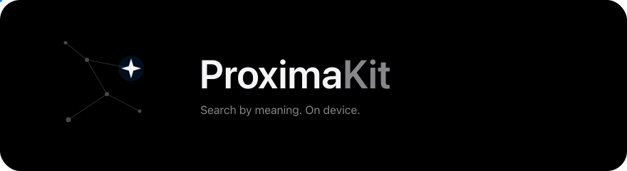
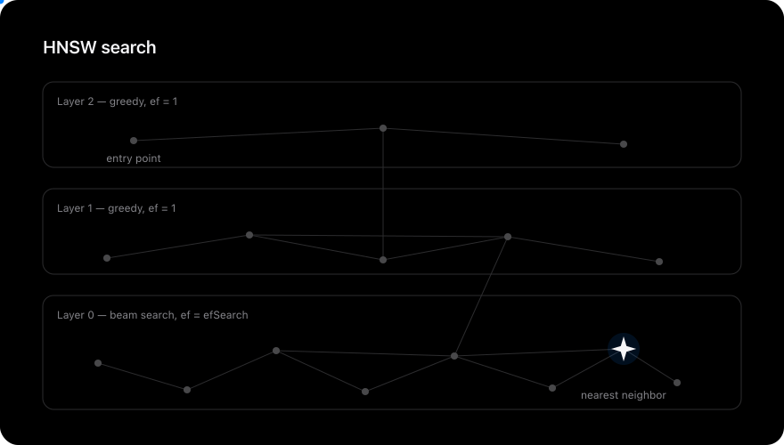
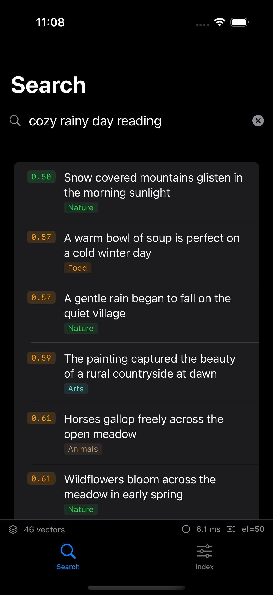
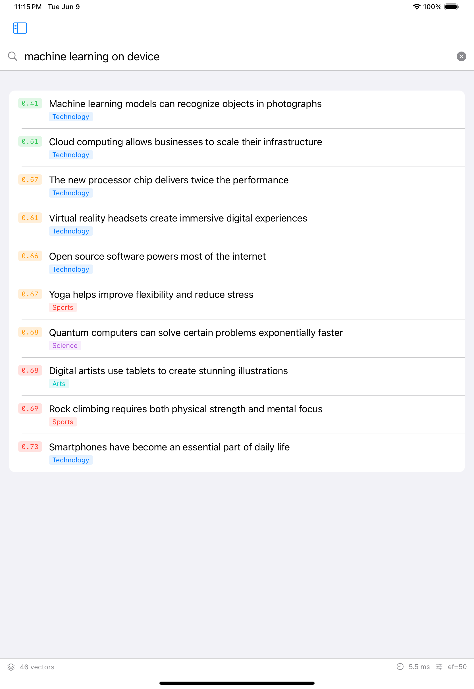

<p align="center">
  
</p>
<p align="center">
    Pure-Swift vector search for Apple platforms — powered by Accelerate.
  </p>
  <p align="center">
    <a href="https://github.com/vivekptnk/ProximaKit/actions/workflows/ci.yml"></a>
    <a href="https://swift.org"></a>
    
    <a href="LICENSE"></a>
  </p>
</p>


ProximaKit finds **similar content by understanding what it means** — not by matching keywords. Type "beach vacation" and it finds photos of oceans, notes about travel, articles about tropical destinations. None of them need to contain the words "beach" or "vacation."

Everything runs **on-device**. No server, no API key, no internet. Just your app and Apple Silicon.

> *HNSW implemented from scratch in Swift. Zero dependencies. Zero C++ wrappers.*

<p align="center">
  
</p>
<p align="center"><sub>Animated replay of a <a href="#demo">real <code>ProximaDemo</code> session</a> — try it: <code>swift run ProximaDemo</code></sub></p>


## What's Inside

| Capability | Details |
|------------|---------|
| **HNSW graph search** | From-scratch multi-layer implementation — heuristic neighbour selection, tombstone deletes, auto-compaction, reproducible builds via `levelSeed` |
| **Hybrid retrieval** | BM25 + dense fusion (`HybridIndex`, `HybridVectorStore`) with Reciprocal Rank Fusion or weighted sum |
| **Product quantization** | 32× vector compression with asymmetric distance computation, plus *(new)* opt-in exact reranking — retain the originals and `search` re-scores the top ADC candidates at full precision (`QuantizedHNSWIndex`, [ADR-011](docs/adr/ADR-011-pq-codec.md), [ADR-012](docs/adr/ADR-012-pq-reranking.md)) |
| **INT8 scalar quantization** | ~4× less vector memory, **works with any metric**, no training phase (`ScalarQuantizedHNSWIndex`, [ADR-007](docs/adr/ADR-007-int8-scalar-quantization.md)) |
| **Filtered search** | `@Sendable` predicate on every index and store; *(new)* graph-aware on `HNSWIndex` — the layer-0 beam applies the filter during traversal with adaptive widening, so selective filters still fill `k` ([ADR-008](docs/adr/ADR-008-filtered-search.md)) |
| **GPU batch distance (v1)** *(new)* | `MetalBatchDistance` — standalone one-query-to-N squared-L2/cosine utility with automatic vDSP fallback. Not yet wired into index build or search; no speedup claimed until measured ([ADR-009](docs/adr/ADR-009-metal-backend.md)) |
| **8 distance metrics** | Cosine, Euclidean, dot product, Manhattan, Hamming, Chebyshev, Bray-Curtis, Mahalanobis — all vDSP-accelerated where it pays |
| **Persistence** | Versioned binary format, fast bulk loads, corruption-hardened loaders ([ADR-003](docs/adr/ADR-003-binary-persistence.md), [ADR-010](docs/adr/ADR-010-format-evolution.md)) |
| **Embedding providers** | Apple NaturalLanguage, Vision, and bring-your-own CoreML (BERT/MiniLM via WordPiece tokenizer) |
| **Concurrency** | Every index is a Swift `actor`; `Sendable` API surface, built with `StrictConcurrency` |
| **Proof** | 400+ tests, recall floors enforced in CI, cross-library benchmark harness vs FAISS/ScaNN running nightly |

<table>
<tr>
<td align="center" width="33%">

```
  ┌─────────────┐
  │      ◆      │
  │    ╱   ╲    │
  │   ◆─────◆   │
  │  ON-DEVICE   │
  └─────────────┘
```

**No Cloud Required**<br/>
Runs entirely on Apple Silicon.<br/>
No server, no API key, no internet.

</td>
<td align="center" width="33%">

```
  ┌─────────────┐
  │    ┌───┐    │
  │    │ 0 │    │
  │    └───┘    │
  │  ZERO DEPS  │
  └─────────────┘
```

**Pure Swift**<br/>
Foundation + Accelerate only.<br/>
No C++ wrappers. No bridging.

</td>
<td align="center" width="33%">

```
  ┌─────────────┐
  │   L2: ·──·  │
  │   L1: ·─·─· │
  │   L0: ····· │
  │  HNSW BUILT │
  └─────────────┘
```

**From Scratch**<br/>
Full HNSW implementation.<br/>
Not a wrapper. Not a port.

</td>
</tr>
</table>


## Overview

ProximaKit is a pure-Swift approximate nearest-neighbour library built from scratch on Apple's Accelerate framework. It provides HNSW-based semantic search — plus hybrid BM25+dense retrieval and two quantization tiers — that runs entirely on-device. No server, no API key, no C++ wrapper required.

The package exposes two libraries: `ProximaKit` (indices, distance metrics, quantization, stores, persistence — Foundation + Accelerate only) and `ProximaEmbeddings` (text/image → vector converters using Apple's NaturalLanguage, Vision, and CoreML frameworks). A CLI demo (`ProximaDemo`) and a macOS SwiftUI demo app (`Examples/ProximaDemoApp`) ship in the same repo.

ProximaKit is the foundation of the Chakravyuha stack and is used by TinyBrain (inference) and Lumen (knowledge retrieval) as their vector-search layer.

## Why ProximaKit?

| | ProximaKit | FAISS (C++) | Pinecone (Cloud) |
|---|---|---|---|
| **Language** | Pure Swift | C++ wrapper | REST API |
| **On-device** | Yes | Needs bridging | No (cloud only) |
| **Dependencies** | Zero | libfaiss, numpy | API key + internet |
| **Thread safety** | Swift actors (compile-time) | Manual locks | N/A |
| **iOS/macOS native** | Yes | No | No |
| **Setup time** | 30 seconds | Hours | Minutes + billing |

How does it actually stack up on speed and recall? We measure instead of claiming — see [Benchmarks](#performance).


## Requirements

- iOS 17+ / macOS 14+ / visionOS 1+ (Accelerate's modern vDSP API requires these)
- Xcode 15+ / Swift 5.9+
- Apple Silicon recommended — the SIMD paths are Apple Silicon–optimised

## Installation

```swift
// Package.swift
dependencies: [
    .package(url: "https://github.com/vivekptnk/ProximaKit.git", from: "1.5.0")
]
```

```swift
.target(
    name: "YourApp",
    dependencies: [
        "ProximaKit",          // Core: indices, metrics, quantization, persistence
        "ProximaEmbeddings",   // Optional: turns text/images into vectors
    ]
)
```

## Quick Start

### Run the Demo

```bash
git clone https://github.com/vivekptnk/ProximaKit.git
cd ProximaKit
swift run ProximaDemo
```

Or open `Examples/ProximaDemoApp/ProximaDemoApp.xcodeproj` in Xcode for the full GUI experience.

### Build a RAG App

Retrieval-augmented generation over your own notes — embed, index, retrieve, and let an on-device language model answer with citations. The whole pipeline is ~100 lines of Swift, works in airplane mode, and ships as a runnable target:

```bash
swift run OnDeviceRAG -question "How long should I steep cold brew?"
```

ProximaKit does the retrieval; Apple's FoundationModels on-device LLM answers where the OS provides one, with a deterministic template model standing in everywhere else. Walkthrough: [`docs/RAG-TUTORIAL.md`](docs/RAG-TUTORIAL.md) · Code: [`Examples/OnDeviceRAG/`](Examples/OnDeviceRAG/)

New to vector search itself? The [interactive DocC tutorial](https://vivekptnk.github.io/ProximaKit/tutorials/meetproximakit) builds the core pipeline step by step.


## How It Works

<p align="center">
  
</p>

```
You type: "beach vacation"
         |
         v
  ┌─────────────────┐
  │ EmbeddingProvider│   Converts text to numbers
  │ "beach" → [0.23, │   that capture its MEANING
  │  -0.41, 0.87...]│   (using Apple's NaturalLanguage)
  └────────┬─────────┘
           v
  ┌─────────────────┐
  │   HNSWIndex      │   Searches a graph structure:
  │                   │   1. Start at top layer (express lane)
  │  Layer 2: ·──·    │   2. Greedily descend to best region
  │  Layer 1: ·─·──·  │   3. Beam search on layer 0
  │  Layer 0: ········ │   4. Return k closest matches
  └────────┬──────────┘
           v
  ┌──────────────────┐
  │  Search Results   │   Ranked by similarity:
  │  0.12 Ocean waves │   Lower distance = more similar
  │  0.18 Tropical... │
  │  0.25 Travel...   │
  └──────────────────┘
```

All of this happens **on your device**, using Apple's Accelerate framework for SIMD math. No internet required.


## Demo

**ProximaDemoApp** is a macOS SwiftUI app that ships with the repo. It indexes 48 sample documents at startup and lets you search by meaning in real time, tune `efSearch` with a slider, add your own notes to the live index, and persist across app launches.

The app now runs on **iPhone, iPad, macOS, and visionOS** from a single SwiftUI target. Real simulator screenshots (semantic search — note zero keyword overlap between query and results):

<p align="center">
  
  &nbsp;&nbsp;
  
</p>

And on Apple Vision Pro, the same target renders as a spatial glass panel (real visionOS simulator screenshot):

<p align="center">
  
</p>

The animated terminal at the top of this README replays a real `swift run ProximaDemo` CLI session, and the desktop layout looks like this (illustrative mock-up):

<p align="center">
  
</p>

Open in Xcode: `open Examples/ProximaDemoApp/ProximaDemoApp.xcodeproj`


## Search Text by Meaning

The simplest thing you can do. Uses Apple's built-in language model — no downloads, no setup.

```swift
import ProximaKit
import ProximaEmbeddings

// Set up
let embedder = try NLEmbeddingProvider(language: .english)
let index = HNSWIndex(dimension: embedder.dimension, metric: CosineDistance())

// Add content
let sentences = [
    "The cat sat on the warm windowsill",
    "Dogs love playing fetch in the park",
    "Fresh pasta tastes better than dried",
    "The sunset painted the sky orange",
]

for sentence in sentences {
    let vector = try await embedder.embed(sentence)
    let metadata = try JSONEncoder().encode(["text": sentence])
    try await index.add(vector, id: UUID(), metadata: metadata)
}

// Search by meaning
let query = try await embedder.embed("animals playing outside")
let results = await index.search(query: query, k: 3)

// Results: "Dogs love playing fetch" (closest match!)
//          "The cat sat on the warm windowsill"
//          "The sunset painted the sky orange"
```

**What happened:** "animals playing outside" found the dog and cat sentences — even though none contain those exact words. It searched by *meaning*.

Need to restrict results — say, to one user's documents? Every index takes a filter:

```swift
let mine = await index.search(query: query, k: 3) { allowedIDs.contains($0) }
```

On `HNSWIndex` the predicate is applied *during* graph traversal (with adaptive beam widening), so even highly selective filters return a full `k` results instead of under-filling ([ADR-008](docs/adr/ADR-008-filtered-search.md)).


## Hybrid Search: Meaning + Keywords

Dense search wins at paraphrase; BM25 wins at exact terms ("error E42", SKUs, names). `HybridIndex` runs both legs concurrently and fuses the rankings:

```swift
let hybrid = HybridIndex(dense: HNSWIndex(dimension: 384), sparse: SparseIndex())
try await hybrid.add(text: chunkText, vector: embedding, id: UUID())
let hits = await hybrid.search(queryText: "error E42", queryVector: queryVector, k: 10)
```

Fusion defaults to Reciprocal Rank Fusion (`.rrf(k: 60)`); `.weightedSum(alpha:)` is available when you've measured your corpus. Full design in [`docs/HYBRID.md`](docs/HYBRID.md).

## Shrink the Index: INT8 Quantization

<p align="center">
  
</p>
<p align="center"><sub>INT8 scalar quantization (any metric, no training — <a href="docs/adr/ADR-007-int8-scalar-quantization.md">ADR-007</a>) and product quantization (L2 ADC, k-means codebooks — <a href="docs/adr/ADR-011-pq-codec.md">ADR-011</a>). Both build a full-precision HNSW graph first, then store only compressed codes; recall floors are CI-asserted.</sub></p>

~4× less vector memory, no training phase, works with any serialisable metric:

```swift
let sq = try await ScalarQuantizedHNSWIndex.build(
    vectors: vectors, ids: ids, dimension: 384, metric: .cosine
)
let hits = await sq.search(query: queryVector, k: 10)
```

Need to go further? `QuantizedHNSWIndex` (product quantization) compresses 32× — at the cost of a k-means training pass and an L2-only search path. The trade-offs are spelled out in [ADR-007](docs/adr/ADR-007-int8-scalar-quantization.md) vs [ADR-011](docs/adr/ADR-011-pq-codec.md).

If recall matters more than the memory win, build the PQ index with `retainOriginals: true`: search then re-scores the top quantized candidates with exact distances before returning, recovering near-full-precision recall ([ADR-012](docs/adr/ADR-012-pq-reranking.md)). Be aware of the trade — retaining originals stores the Float32 vectors again, so you give up the compression story for accuracy.


## Search Images

```swift
let vision = VisionEmbeddingProvider()
let vector = try await vision.embed(myCGImage)
try await imageIndex.add(vector, id: photoID)

// Find visually similar images
let queryVector = try await vision.embed(anotherImage)
let similar = await imageIndex.search(query: queryVector, k: 5)
```


## Save and Load

Don't rebuild the index every time your app launches.

```swift
// Save (compact binary format)
try await index.save(to: fileURL)

// Load (single bulk read; the index is fully in memory afterwards)
let loaded = try HNSWIndex.load(from: fileURL)
```

The format carries a magic number and version field; loaders validate graph structure before trusting it and throw typed `PersistenceError`s on corrupt input instead of crashing. Evolution policy: [ADR-010](docs/adr/ADR-010-format-evolution.md).


## Use a Custom AI Model (CoreML)

For higher quality search, bring a real sentence-transformer model:

```swift
let provider = try CoreMLEmbeddingProvider(
    modelAt: modelURL,
    vocabURL: vocabURL   // WordPiece vocab for proper tokenization
)
let vector = try await provider.embed("sunset over the ocean")
```

To convert a HuggingFace model to CoreML, use [coremltools](https://github.com/apple/coremltools):

```bash
pip install coremltools transformers
python -c "
import coremltools as ct
from transformers import AutoModel, AutoTokenizer

model = AutoModel.from_pretrained('sentence-transformers/all-MiniLM-L6-v2')
# Export to CoreML with coremltools.convert()
"
```

Pass the compiled model's URL to `CoreMLEmbeddingProvider(modelAt:vocabURL:)` — the library never scans directories. (The demo app additionally looks for models in its own `Models/` folder as a convenience.)


## Architecture

```
                ┌─────────────────────────────────────┐
                │         Y O U R   A P P             │
                │            (SwiftUI)                 │
                └──────────────┬──────────────────────┘
                               │
                     embed()   │   search()
                               │
           ┌───────────────────┼───────────────────────┐
           │                   │    ProximaEmbeddings   │
           │                   v                        │
           │   ┌──────────┐  ┌──────────┐  ┌────────┐ │
           │   │ NLEmbed  │  │ Vision   │  │ CoreML │ │
           │   │ Provider │  │ Provider │  │Provider│ │
           │   └─────┬────┘  └────┬─────┘  └───┬────┘ │
           │         └────────────┼─────────────┘      │
           │                      │                     │
           │        EmbeddingProvider protocol          │
           └──────────────────────┼────────────────────┘
                                  │
                        [Float] vectors
                                  │
           ┌──────────────────────┼────────────────────┐
           │                      v     ProximaKit     │
           │                                            │
           │   ┌────────────────────────────────────┐  │
           │   │  S T O R E S                       │  │
           │   │  VectorStore · HybridVectorStore   │  │
           │   │  (document-level chunks + saves)   │  │
           │   └──────────────┬─────────────────────┘  │
           │                  │                         │
           │   ┌──────────────┴─────────────────────┐  │
           │   │  I N D E X   L A Y E R             │  │
           │   │                                     │  │
           │   │  HNSWIndex            BruteForce    │  │
           │   │  ◆──◆──◆  O(log n)    ◆◆◆  O(n)    │  │
           │   │                                     │  │
           │   │  QuantizedHNSW (PQ, 32×)            │  │
           │   │  ScalarQuantizedHNSW (INT8, ~4×)    │  │
           │   │  SparseIndex (BM25) · HybridIndex   │  │
           │   └──────────────┬─────────────────────┘  │
           │                  │                         │
           │   ┌──────────────┴─────────────────────┐  │
           │   │  D I S T A N C E   M E T R I C S   │  │
           │   │  cosine · euclidean · dot product   │  │
           │   │  manhattan · hamming · chebyshev    │  │
           │   │  bray-curtis · mahalanobis          │  │
           │   │       (vDSP / Accelerate)           │  │
           │   └──────────────┬─────────────────────┘  │
           │                  │                         │
           │   ┌──────────────┴─────────────────────┐  │
           │   │  P E R S I S T E N C E             │  │
           │   │  versioned binary · mmap · hardened │  │
           │   └────────────────────────────────────┘  │
           │                                            │
           │   Foundation + Accelerate ONLY             │
           └────────────────────────────────────────────┘
```

| Module | What It Does |
|--------|-------------|
| `ProximaKit` | Core engine: vectors, 8 distance metrics, HNSW + quantized + sparse + hybrid indices, stores, persistence |
| `ProximaEmbeddings` | Converts text/images to vectors using Apple frameworks |
| `ProximaDemo` | Interactive demo app with live semantic search |

Deep dive: [`docs/ARCHITECTURE.md`](docs/ARCHITECTURE.md)


## Performance

Measured numbers live in [`docs/BENCHMARKS.md`](docs/BENCHMARKS.md) with full methodology; the highlights:

```
 ╔══════════════════════════════════════════════════════╗
 ║              P E R F O R M A N C E                   ║
 ╠══════════════════════════════════════════════════════╣
 ║                                                      ║
 ║  ⚡ Release-mode p50/p95 latency + QPS: published   ║
 ║     nightly from the FAISS/ScaNN harness (CI        ║
 ║     artifacts — never hand-copied, never stale)     ║
 ║  ⚡ Cold start   ~50 ms load (10K-vector index)     ║
 ║                                                      ║
 ║  ◎ Recall@10, real embeddings (512d):               ║
 ║      100% measured  ·  >95% enforced in CI          ║
 ║  ◎ Recall@10 floors:                                ║
 ║      ≥95% INT8-quantized (euclidean) — CI-enforced  ║
 ║      >90% @ 1K · >82% @ 10K (random vectors,        ║
 ║      asserted in the benchmark suite*)              ║
 ║                                                      ║
 ║  ✓ Save/load roundtrip: exact binary match           ║
 ║  ✓ vDSP batch ops beat naive loops (CI-asserted)     ║
 ║                                                      ║
 ╚══════════════════════════════════════════════════════╝
```

<sub>* `RecallBenchmarkTests` is benchmark-class and excluded from the PR test job; run it with `swift test -c release --filter RecallBenchmarkTests`. The `benchmark.yml` smoke job separately gates core-touching PRs at recall@10 ≥ 0.90 on SIFT-10K.</sub>

**Cross-library comparison (FAISS, ScaNN):** numbers are generated nightly by [`benchmark.yml`](.github/workflows/benchmark.yml) on SIFT1M-100K against shared brute-force ground truth (MS MARCO-50K is available in the harness for manual runs), and published as CI artifacts — never hand-copied into docs where they'd go stale. Harness + methodology: [`Benchmarks/`](Benchmarks/README.md), [ADR-005](docs/adr/ADR-005-benchmark-methodology.md). Results are reported honestly, including when ProximaKit loses.


## Which Index Should I Use?

| Index | When | Memory |
|-------|------|--------|
| `HNSWIndex` | **Most cases.** Fast approximate search, O(log n). | Full (Float32) |
| `BruteForceIndex` | Under 1,000 items. 100% exact accuracy, O(n). | Full (Float32) |
| `ScalarQuantizedHNSWIndex` | Memory-constrained, any metric, no training. | **~4× smaller** |
| `QuantizedHNSWIndex` | Maximum compression, L2 workloads, can afford training. Opt-in exact reranking recovers recall — but stores originals again ([ADR-012](docs/adr/ADR-012-pq-reranking.md)). | **32× smaller** |
| `SparseIndex` | Keyword/BM25 search, no embeddings needed. | Postings lists |
| `HybridIndex` | Best of both: semantic + exact-term recall. | Dense + sparse legs |

`HNSWIndex` and `BruteForceIndex` share the same `VectorIndex` API — swap them without changing any other code.


## Which Distance Metric?

| Metric | When | Plain English |
|--------|------|---------------|
| `CosineDistance()` | **Text search.** Use this unless you have a reason not to. | "How different is the direction?" |
| `EuclideanDistance()` | Spatial data (coordinates, sensors). | "How far apart are these?" |
| `DotProductDistance()` | Pre-normalized vectors (advanced). | "How aligned are these?" |
| `ManhattanDistance()` | Sparse data, grid-based problems. | "How many blocks apart?" |
| `HammingDistance()` | Binary/quantized vectors. | "How many bits differ?" |
| `ChebyshevDistance()` | Worst-case-dimension comparisons, game grids. | "What's the single biggest gap?" |
| `BrayCurtisDistance()` | Compositional/count data (ecology, histograms). | "How dissimilar are the proportions?" |
| `MahalanobisDistance(covariance:)` | Correlated dimensions with different scales. | "How far apart, accounting for spread?" |

All eight conform to the same `DistanceMetric` protocol. One caveat: `MahalanobisDistance` carries a matrix, so it is search-only — indices built with it cannot be persisted (`save` throws `PersistenceError.unserializableMetric`).


## Tuning

```swift
let config = HNSWConfiguration(
    m: 16,               // Connections per node
    efConstruction: 200,  // Build quality
    efSearch: 50,         // Search quality
    levelSeed: 42         // Optional: reproducible graph construction
)
```

| Problem | Fix |
|---------|-----|
| Results aren't relevant | Increase `efSearch` (try 100-200) |
| Search too slow | Decrease `efSearch` (try 20) |
| Too much memory | Decrease `m` (try 8) — or switch to a quantized index |
| Build takes too long | Decrease `efConstruction` (try 100) |
| Flaky recall in tests | Set `levelSeed` for deterministic graph topology |


## Thread Safety

ProximaKit is fully thread-safe. Every index and store is a Swift `actor`, the public surface is `Sendable`, and the package builds with `StrictConcurrency` enabled — the compiler enforces it at build time.

```swift
// Safe from any thread or Task:
let results = await index.search(query: vector, k: 10)
try await index.add(newVector, id: UUID())
```


## API Reference

### ProximaKit (core)

| Type | What |
|------|------|
| `Vector` | A list of floats. The fundamental data type. |
| `HNSWIndex` | Fast approximate search (use this one). |
| `BruteForceIndex` | Exact search (for small datasets). |
| `ScalarQuantizedHNSWIndex` | INT8-compressed HNSW (~4×, any metric). |
| `QuantizedHNSWIndex` | PQ-compressed HNSW (32×, L2 ADC). |
| `SparseIndex` | BM25 keyword index (Okapi, Lucene-style IDF). |
| `HybridIndex` | Dense + sparse fusion (RRF / weighted sum). |
| `VectorStore` | Document-level layer: chunks, metadata, saves. |
| `HybridVectorStore` | Same, over a hybrid index. |
| `ScalarQuantizer` / `ProductQuantizer` | The codecs behind the quantized indices. |
| `MetalBatchDistance` | Standalone GPU one-query-to-N batch distances (vDSP fallback; not used by the indices yet). |
| `CosineDistance` … `MahalanobisDistance` | The 8 distance metrics. |
| `SearchResult` | Result: `id`, `distance`, `metadata`. |
| `HNSWConfiguration` | Tuning: `m`, `efConstruction`, `efSearch`, `autoCompactionThreshold`, `levelSeed`. |
| `BM25Configuration` | Tuning: `k1`, `b`, `autoCompactionThreshold`. |
| `PersistenceEngine` | Versioned binary save/load with memory mapping. |

### ProximaEmbeddings (content to vectors)

| Type | What |
|------|------|
| `NLEmbeddingProvider` | Text to vector. Apple's built-in model. No setup. |
| `VisionEmbeddingProvider` | Image to vector. Apple's Vision framework. |
| `CoreMLEmbeddingProvider` | Any CoreML model (BERT, MiniLM, etc). |
| `WordPieceTokenizer` | BERT-compatible tokenizer for CoreML models. |


## Documentation

- **API reference (DocC):** <https://vivekptnk.github.io/ProximaKit/> — rebuilt and published from `main` on every push
- **Interactive tutorial:** [Build On-Device Semantic Search](https://vivekptnk.github.io/ProximaKit/tutorials/meetproximakit) — a step-by-step DocC tutorial: create an index, embed text with NLEmbedding, search by meaning, persist to disk
- **Guides:** [`docs/ARCHITECTURE.md`](docs/ARCHITECTURE.md) · [`docs/HYBRID.md`](docs/HYBRID.md) · [`docs/BENCHMARKS.md`](docs/BENCHMARKS.md) · [`docs/RAG-TUTORIAL.md`](docs/RAG-TUTORIAL.md)

## Design Decisions

See [`docs/adr/`](docs/adr/) for Architecture Decision Records:
- [ADR-001](docs/adr/ADR-001-accelerate-for-math.md): Why Accelerate/vDSP for all vector math
- [ADR-002](docs/adr/ADR-002-actor-isolation.md): Why actors for thread safety
- [ADR-003](docs/adr/ADR-003-binary-persistence.md): Why custom binary (not JSON)
- [ADR-004](docs/adr/ADR-004-hnsw-heuristic-selection.md): Why heuristic neighbor selection
- [ADR-005](docs/adr/ADR-005-benchmark-methodology.md): Cross-library benchmark methodology
- [ADR-007](docs/adr/ADR-007-int8-scalar-quantization.md): INT8 scalar quantization codec
- [ADR-008](docs/adr/ADR-008-filtered-search.md): Filtered search (post-filter, plus the graph-aware addendum for `HNSWIndex`)
- [ADR-009](docs/adr/ADR-009-metal-backend.md): Metal batch distance — v1 scoped to a standalone utility
- [ADR-010](docs/adr/ADR-010-format-evolution.md): Persistence format evolution policy
- [ADR-011](docs/adr/ADR-011-pq-codec.md): Product quantization codec
- [ADR-012](docs/adr/ADR-012-pq-reranking.md): Full-precision reranking for quantized HNSW
- [ADR-013](docs/adr/ADR-013-streaming-persistence.md): Streaming persistence (proposed — design only, not implemented)


## Building & Testing

```bash
# Build
swift build

# Unit + integration tests (fast)
swift test --skip RecallBenchmarkTests

# Full recall benchmarks (slow, needs Release mode)
swift test -c release --filter RecallBenchmarkTests

# Generate DocC documentation
swift package generate-documentation --target ProximaKit
```

CI runs the full functional suite (400+ tests; benchmark classes run separately), SwiftLint, an iOS Simulator build, DocC generation, and a release-consistency check on every PR — plus a benchmark smoke-slice regression gate on PRs that touch the core index.


## Roadmap

See [`docs/ROADMAP.md`](docs/ROADMAP.md) for the detailed plan. Highlights:

| Area | Status |
|------|--------|
| Graph-aware filtered search — higher recall under selective filters | **Shipped** for `HNSWIndex` ([ADR-008 addendum](docs/adr/ADR-008-filtered-search.md)); quantized and sparse indexes still post-filter |
| GPU acceleration | v1 shipped: `MetalBatchDistance` batch utility ([ADR-009](docs/adr/ADR-009-metal-backend.md)). Index build/search integration still planned — gated on measured speedups |
| Streaming persistence — incremental saves (WAL) + paged vectors | Proposed, design only ([ADR-013](docs/adr/ADR-013-streaming-persistence.md)) |
| Jensen-Shannon divergence metric | Considering |
| Background HNSW compaction policy | Planned |
| Demo app — CoreML model download UI, benchmark tab, result export | Planned |


## License

MIT — use it for anything.

**Author:** [Vivek Pattanaik](https://github.com/vivekptnk)
