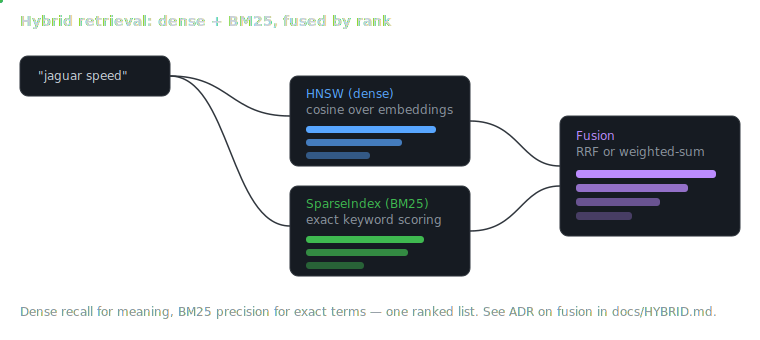

# Hybrid Retrieval in ProximaKit

**Status:** Shipped in v1.4.0
**Layers:** `SparseIndex` (BM25) → `HybridIndex` (fusion) → `HybridVectorStore` (document-level)

ProximaKit v1.4 adds lexical + dense hybrid retrieval on top of the existing
`HNSWIndex`. This document covers the three new types, the fusion strategies,
and the one-line Lumen opt-in.

> Core `ProximaKit` stays Foundation + Accelerate only. No new external
> dependencies are introduced.

---

## Why hybrid?

Dense (ANN) retrieval wins at paraphrase and semantic similarity. It loses on
rare terms, product codes, inline identifiers, and any vocabulary that embedding
models dilute. BM25 is the opposite: precise on surface form, blind to meaning.

Hybrid retrieval fuses both ranked lists. In practice this gives:

- **Better recall on exact-match queries** ("error code E42", SKUs, names).
- **Resilience when one leg is weak** — the other leg still anchors the result
  set.
- **No tuning burden out of the box** — the default fusion strategy
  (Reciprocal Rank Fusion, `k = 60`) is score-scale-agnostic.

---

## Architecture

<p align="center">
  
</p>

```
                    ┌─────────────────────────────────┐
                    │        HybridVectorStore         │
                    │  (document chunks + embedder)    │
                    └────────────────┬────────────────┘
                                     │
                                     ▼
                    ┌─────────────────────────────────┐
                    │           HybridIndex            │
                    │   (RRF or weighted-sum fusion)   │
                    └───────┬──────────────────┬──────┘
                            │                  │
                            ▼                  ▼
                   ┌──────────────┐   ┌────────────────┐
                   │  HNSWIndex   │   │  SparseIndex   │
                   │   (dense)    │   │  (BM25 / lex)  │
                   └──────────────┘   └────────────────┘
```

Both legs are actors. `HybridIndex` fans out queries concurrently via `async
let` and merges rankings with a `HybridFusionStrategy`. `HybridVectorStore`
wraps the index with auto-embedding and the same document-level API surface
`VectorStore` already exposes.

`VectorStore` is **unchanged**. Consumers opt into hybrid retrieval by
constructing `HybridVectorStore` directly — the v1.1 API stays frozen.

---

## `SparseIndex` (BM25)

```swift
let index = SparseIndex(
    tokenizer: DefaultBM25Tokenizer(),
    configuration: BM25Configuration(k1: 1.2, b: 0.75)
)

try await index.add(text: "hybrid retrieval rocks", id: UUID())
let hits = await index.search(query: "retrieval", k: 10)
```

- **Scoring:** Okapi BM25 with Lucene-style `log(1 + (N − df + 0.5) / (df + 0.5))`
  IDF (non-negative, stable with high-df terms).
- **Tokenization:** `BM25Tokenizer` protocol. The default tokenizer uses
  Foundation's Unicode word-break segmentation plus lowercasing — no
  NaturalLanguage / NSLinguisticTagger dependency.
- **Mutation:** actor-isolated `add` / `remove`, same tombstoning + auto-compact
  behavior as `HNSWIndex` (threshold defaults to `0.7`).
- **Persistence:** `.pxbm` binary file. `PersistenceEngine.save(_:to:)` and
  `SparseIndex.load(from:tokenizer:)`. Compacts before writing so tombstones
  never leak across a save/load cycle.

### Bring-your-own tokenizer

For language-aware tokenization (e.g. Lumen's `NLTokenizer`), implement
`BM25Tokenizer`:

```swift
import NaturalLanguage

struct NLTokenizerBM25: BM25Tokenizer {
    func tokenize(_ text: String) -> [String] {
        let tokenizer = NLTokenizer(unit: .word)
        tokenizer.string = text
        var out: [String] = []
        tokenizer.enumerateTokens(in: text.startIndex..<text.endIndex) { range, _ in
            out.append(text[range].lowercased())
            return true
        }
        return out
    }
}
```

The tokenizer is not serialized with the index — the caller supplies it on
`SparseIndex.load(from:tokenizer:)`. Keep insert-time and query-time tokenizers
equivalent, or BM25 statistics and live queries will disagree.

---

## `HybridIndex` and fusion strategies

```swift
let dense = HNSWIndex(dimension: 384)
let sparse = SparseIndex()
let hybrid = HybridIndex(dense: dense, sparse: sparse, fusion: .rrf(k: 60))

try await hybrid.add(
    text: "hybrid retrieval",
    vector: embedding,
    id: UUID()
)
let hits = await hybrid.search(
    queryText: "hybrid",
    queryVector: queryEmbedding,
    k: 10
)
```

### Reciprocal Rank Fusion (default)

```swift
HybridFusionStrategy.rrf(k: 60)    // default k = 60
```

For each document `d`, score `= Σ 1 / (k + rank_i(d))` across legs where the
doc appears. RRF is the robust first pass — it's agnostic to the raw score
scale of each leg, which matters because BM25 scores and dense distances live
in wildly different ranges.

The `k` parameter flattens the contribution of low ranks. `k = 60` follows
Cormack et al. (SIGIR 2009).

### Weighted sum

```swift
HybridFusionStrategy.weightedSum(alpha: 0.6)    // 60% dense, 40% sparse
```

Min-max normalizes each leg's scores into `[0, 1]` (higher = better), then
returns `α · dense + (1 − α) · sparse`.

- `α = 1.0` degenerates to dense-only.
- `α = 0.0` degenerates to sparse-only.
- Use only when you've validated both legs' score distributions on your own
  corpus. RRF is the better default.

### Candidate pool

`HybridIndex.search(...)` accepts `candidatePoolK` to control how many results
to fetch per leg **before** fusing. Default: `max(k × 5, 50)`. Larger pools
improve recall when the two legs barely overlap, at the cost of extra work per
query.

### Invariant

`fused top-k ⊇ (dense top-k ∩ sparse top-k)` whenever `candidatePoolK ≥ k`.
A document ranked in both legs' top-k lists must also appear in the fused
top-k — verified by the test suite.

---

## `HybridVectorStore`

`HybridVectorStore` is the hybrid analog of `VectorStore`. Same
`addChunks(_:metadata:)` / `query(_:k:)` / `removeDocument(id:)` / `save()`
surface, just built on `HybridIndex`.

```swift
let store = try HybridVectorStore(
    name: "notebook",
    embedder: NLEmbeddingProvider(),
    storageDirectory: appSupportURL,
    fusion: .rrf()
)

try await store.addChunks(chunks, metadata: metadata)
let results = try await store.query("retrieval augmented generation", k: 10)
try await store.save()
```

Persistence layout:

```
<storageDirectory>/<name>/
├── index.pxkt      # dense HNSW
├── index.pxbm      # sparse BM25
└── hybrid.json     # document → chunk UUIDs map
```

Both legs persist independently; the hybrid wrapper carries only the
document map.

---

## Lumen opt-in

Lumen's RAG pipeline currently uses `VectorStore`. The hybrid opt-in is a
one-line swap at the construction site:

```swift
// Before — dense-only retrieval
let store = try VectorStore(
    name: notebookName,
    embedder: embedder,
    storageDirectory: appSupportURL
)

// After — hybrid retrieval
let store = try HybridVectorStore(
    name: notebookName,
    embedder: embedder,
    storageDirectory: appSupportURL
    // fusion defaults to .rrf(k: 60); tune only after measuring.
)
```

The rest of the RAG flow (`addChunks`, `query`, `removeDocument`, `save`) is
shape-compatible — `HybridVectorStore` is source-compatible with the
`VectorStore` shape on those methods.

### Recommended migration path for Lumen

1. Ship `HybridVectorStore` behind a feature flag in a canary build.
2. Mirror writes to both `VectorStore` and `HybridVectorStore` on new ingests.
3. Measure recall@k on a held-out evaluation set (Lumen-side — ProximaKit has
   no opinions on Lumen's eval).
4. Flip the flag on when hybrid wins on Lumen's own metrics.
5. Stop mirror-writing once the hybrid index is authoritative.

---

## Performance notes

- Sparse search is O(|query terms| × avg postings length). Scales with
  vocabulary density more than raw document count.
- Hybrid search issues both legs concurrently via `async let`. Wall-clock cost
  ≈ `max(dense, sparse) + fusion overhead`.
- Fusion is O(|dense| + |sparse|) for RRF; add a hash map probe per entry for
  weighted sum's normalization pass. Dominated by the per-leg search cost.

Cross-library benchmarks (FAISS, ScaNN) live in
[`BENCHMARKS.md` → Cross-Library Comparison](BENCHMARKS.md#cross-library-comparison),
backed by the reproducible harness under `Benchmarks/`.

---

## References

- Robertson & Zaragoza, *The Probabilistic Relevance Framework: BM25 and
  Beyond* (2009).
- Cormack, Clarke, Büttcher, *Reciprocal rank fusion outperforms Condorcet
  and individual rank learning methods* (SIGIR 2009).
- Lucene BM25 similarity: Lucene `BM25Similarity` (v9.x) for the IDF formula.
